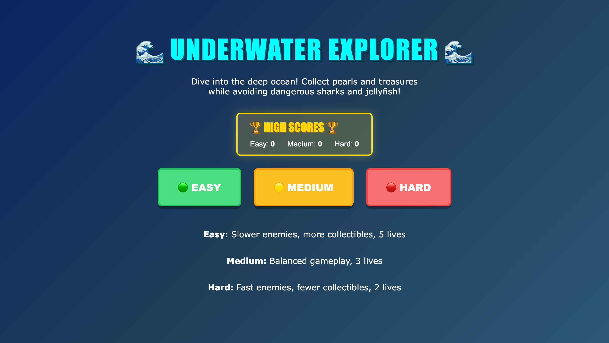

# 🌊 Underwater Explorer

An interactive underwater exploration game built with HTML5, CSS, and JavaScript for Hacktoberfest 2025.

## 📸 Screenshots

### Main Menu

### Gameplay

## 🎮 How to Play

- Use **↑↓ Arrow Keys** or **W/S** to move up and down
- Press **→ or D** to boost forward
- Collect **💎 Pearls** (10 points) and **👑 Treasures** (50 points)
- Avoid **🦈 Sharks** and **🪼 Jellyfish**

## 🎯 Features

- ✅ 3 difficulty levels (Easy, Medium, Hard)
- ✅ High score system with localStorage persistence
- ✅ Smooth animations and particle effects
- ✅ Auto-scrolling gameplay with boost feature
- ✅ Lives system with damage feedback
- ✅ Responsive controls (Arrow Keys/WASD)
- ✅ Animated marine life (fish, corals, bubbles)
- ✅ Collision detection system

## 🚀 How to Run

Simply open `index.html` in any modern web browser! No server or dependencies required.

## 🛠️ Technologies

- HTML5 Canvas API
- CSS3 (Animations & Gradients)
- Vanilla JavaScript (ES6+)
- localStorage API for high score persistence

## 🎨 Game Mechanics

- **Scoring:** Pearls = 10 points, Treasures = 50 points
- **Lives:** Varies by difficulty (Easy: 5, Medium: 3, Hard: 2)
- **Enemies:** Sharks and Jellyfish with dynamic spawn rates
- **High Scores:** Saved per difficulty level using browser localStorage

## 📦 File Structure
underwater-explorer/
├── index.html # Complete game (HTML + CSS + JS)
├── README.md # Documentation
├── gameplay.png # Main menu screenshot
└── gameplay1.png # Gameplay screenshot
 
## 🏆 Contributing

This project was created for Hacktoberfest 2025. Feel free to fork and improve!

## 📄 License

MIT License - Feel free to use and modify!

