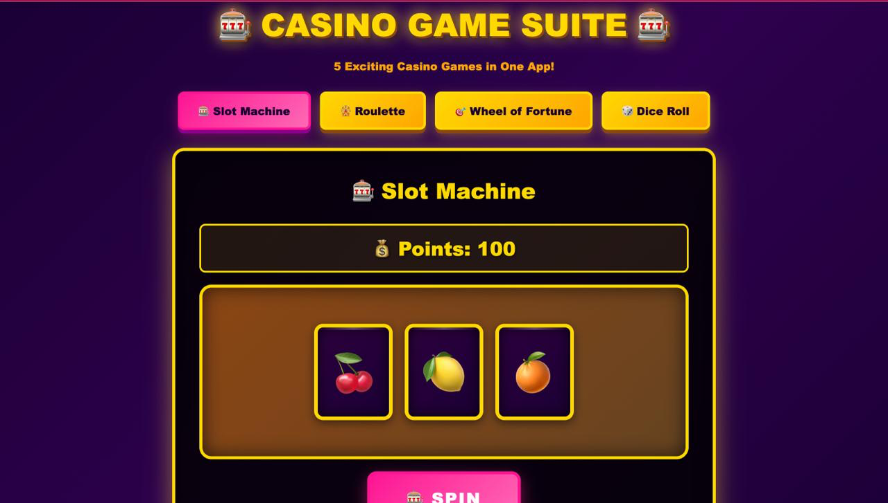
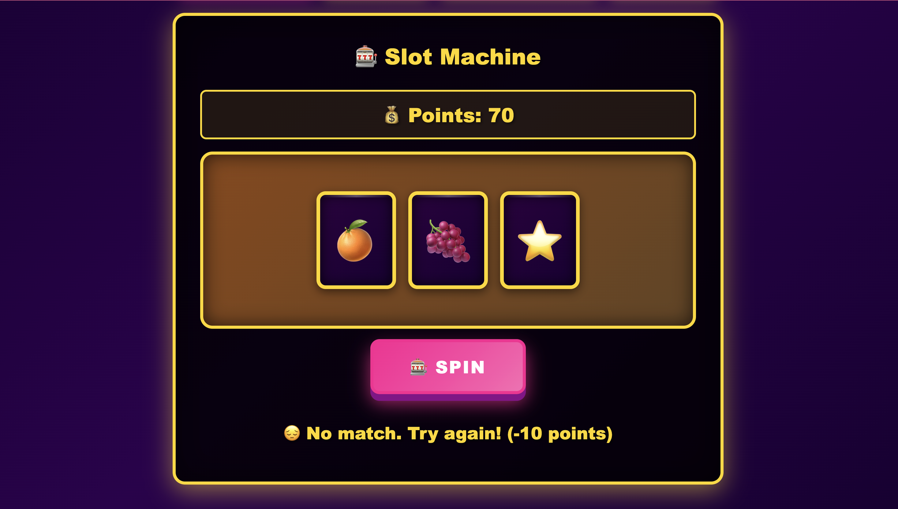
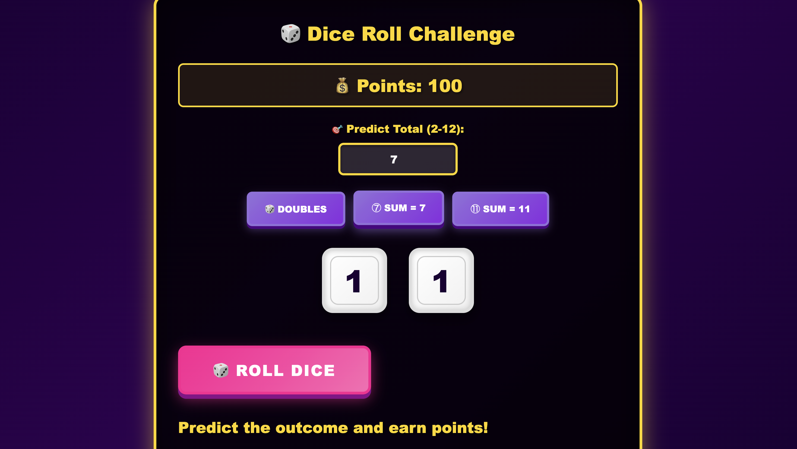

# 🎰 Casino Game Suite

An interactive casino game collection featuring 5 exciting games built entirely with HTML, CSS, and JavaScript. Created for Hacktoberfest 2025.

## 🎮 About The Project

Casino Game Suite is a web-based collection of 5 classic casino games that run directly in your browser. No downloads, no installations - just pure gaming fun! Each game features smooth animations, realistic mechanics, and a point-based reward system.

## 🎯 Games Included

### 1. 🎰 Slot Machine
Spin the reels and match symbols to win points!

**Features:**
- 3 animated reels with 8 different symbols (🍒🍋🍊🍇🍉⭐💎🔔)
- Smooth spinning animations
- Multiple winning combinations
- Progressive jackpot system

**Prizes:**
- 💎💎💎 **Triple Diamonds Jackpot:** +100 points
- ⭐⭐⭐ **Triple Stars:** +75 points
- Any Three of a Kind: +50 points
- Two Matching Symbols: +20 points
- **Cost:** 10 points per spin

### 2. 🎡 Roulette Simulator
Place your bets and spin the wheel of fortune!

**Features:**
- Realistic roulette wheel with 37 numbers (0-36)
- Color-coded betting system (Red, Black, Green)
- Multiple betting options (Odd/Even, High/Low)
- Smooth 4-second spin animation

**Betting Options:**
- **Red/Black:** 2x payout (+20 points)
- **Green (0):** 35x payout (+350 points)
- **Odd/Even Numbers:** 2x payout (+20 points)
- **High (19-36):** 2x payout (+20 points)
- **Cost:** 10 points per spin

### 3. 🎯 Wheel of Fortune
Spin for prizes ranging from 5 to 500 points!

**Features:**
- 8-segment colorful prize wheel
- Prize labels visible on wheel
- Smooth 5-second spin with deceleration
- Random prize selection

**Prizes:**
- 500 points (Jackpot)
- 250 points
- 100 points
- 50 points
- 25 points
- 10 points
- 5 points
- LOSE (no prize)
- **Cost:** 10 points per spin

### 4. 🎲 Dice Roll Challenge
Roll two dice and predict the outcome to earn big points!

**Features:**
- Two animated dice with realistic rolling motion
- Multiple prediction options
- Manual total prediction (2-12)
- Visual feedback for wins/losses

**Prediction Options:**
- 🎲 **Doubles (1-1, 2-2, etc.):** +60 points
- ⑦ **Sum equals 7:** +40 points
- ⑪ **Sum equals 11:** +50 points
- 🎯 **Exact Total Prediction:** +30 points
- **Cost:** 10 points per roll

## ✨ Key Features

- 🎨 **Beautiful UI:** Retro casino aesthetic with golden accents
- 🎭 **Smooth Animations:** All games feature professional-grade animations
- 📱 **Fully Responsive:** Works perfectly on desktop, tablet, and mobile
- 💰 **Point System:** Each game has its own point balance starting at 100
- 🎯 **Easy Navigation:** Switch between games with a single click
- 🚫 **Game Over Detection:** Automatic detection when points reach zero
- ⚡ **No Dependencies:** Pure vanilla JavaScript - no frameworks needed
- 🔒 **Client-Side Only:** No server required, runs entirely in browser

## 🚀 How to Play

### Getting Started

1. **Download/Clone** this repository
2. Open \`index.html\` in any modern web browser
3. Select a game from the top menu
4. Each game starts with **100 points**
5. Follow game-specific instructions to play

### General Rules

- Each game costs **10 points** to play
- Win points based on outcomes
- Game ends when points reach **0**
- Refresh page to restart with 100 points

### Game-Specific Instructions

#### Slot Machine
1. Click **"SPIN"** button
2. Wait for reels to stop spinning
3. Match 3 symbols for big wins
4. Even 2 matches earn you points!

#### Roulette
1. Select your bet (Red, Black, Green, Odd, Even, or High)
2. Click **"SPIN WHEEL"**
3. Watch the wheel spin for 4 seconds
4. Win if your bet matches the result

#### Wheel of Fortune
1. Click **"SPIN WHEEL"**
2. Watch the wheel spin for 5 seconds
3. Win the prize where the pointer lands
4. Prizes range from 5 to 500 points

#### Dice Roll Challenge
1. **Optional:** Enter a total prediction (2-12)
2. **Optional:** Select quick predictions (Doubles, Sum=7, Sum=11)
3. Click **"ROLL DICE"**
4. Watch dice animate and reveal results
5. Win points if your prediction matches!

## 🛠️ Technologies Used

### Core Technologies
- **HTML5** - Structure and semantic markup
- **CSS3** - Styling, animations, and gradients
- **JavaScript (ES6+)** - Game logic and interactivity

### CSS Features Used
- CSS Grid & Flexbox for layouts
- CSS Animations & Transforms
- Gradient backgrounds
- Box shadows and visual effects
- Media queries for responsiveness

### JavaScript Features Used
- DOM manipulation
- Event listeners
- SetInterval/SetTimeout for animations
- Math.random() for game mechanics
- Template literals
- Arrow functions

## 📦 File Structure

\`\`\`
casino-game-suite/
├── index.html          # Complete game suite (HTML + CSS + JS)
├── README.md          # This file
└── screenshots/       # Optional: Game screenshots
    ├── menu.png
    ├── slot-machine.png
    ├── roulette.png
    ├── wheel-fortune.png
    └── dice-game.png
\`\`\`

## 💻 Installation & Usage

### Quick Start

\`\`\`bash
# Clone the repository
git clone https://github.com/aryanraj45/Anti-Boredom.git

# Navigate to game folder
cd Anti-Boredom/casino-game-suite

# Open in browser
# Just double-click index.html
# OR use a local server (recommended):

# Python 3
python -m http.server 8000

# Then open: http://localhost:8000
\`\`\`

### Browser Compatibility

✅ Chrome 90+
✅ Firefox 88+
✅ Safari 14+
✅ Edge 90+
✅ Opera 76+

### Mobile Support

- ✅ iOS Safari 14+
- ✅ Android Chrome 90+
- ✅ Samsung Internet 14+

## 🎨 Screenshots

### Main Menu

### Slot Machine

### Roulette

### Wheel of Fortune

### Dice Roll Challenge

## 🎲 Game Mechanics

### Point System
- Starting Balance: **100 points per game**
- Cost Per Play: **10 points**
- Minimum to Play: **10 points**
- Game Over: **0 points**

### Win Probabilities

**Slot Machine:**
- Triple Jackpot (💎💎💎): ~1.5% chance
- Triple Stars: ~1.5% chance
- Any Triple: ~12% chance
- Two Match: ~38% chance

**Roulette:**
- Red/Black: 48.6% chance (18/37)
- Green (0): 2.7% chance (1/37)
- Odd/Even: 48.6% chance
- High: 48.6% chance

**Wheel of Fortune:**
- Each segment: 12.5% chance (1/8)
- Jackpot (500): 12.5% chance

**Dice Roll:**
- Doubles: 16.7% chance (6/36)
- Sum = 7: 16.7% chance (6/36)
- Sum = 11: 5.6% chance (2/36)
- Exact prediction: Varies by number

## 🔧 Customization

### Modify Point Values

Edit JavaScript section in \`index.html\`:

\`\`\`javascript
// Change starting points
let slotPoints = 200;  // Default: 100
let roulettePoints = 200;
let fortunePoints = 200;
let dicePoints = 200;
\`\`\`

### Change Slot Symbols

\`\`\`javascript
const slotSymbols = ['🍒', '🍋', '🍊', '🍇', '🍉', '⭐', '💎', '🔔', '🎰', '💰'];
\`\`\`

### Adjust Prize Values

\`\`\`javascript
// Modify prize amounts in each game function
if (r1 === '💎') {
    slotPoints += 200;  // Change from 100
}
\`\`\`

## 🤝 Contributing

This project was created for **Hacktoberfest 2025**. Contributions are welcome!

### How to Contribute

1. Fork the repository
2. Create your feature branch (\`git checkout -b feature/AmazingFeature\`)
3. Commit your changes (\`git commit -m 'Add some AmazingFeature'\`)
4. Push to the branch (\`git push origin feature/AmazingFeature\`)
5. Open a Pull Request

### Contribution Ideas

- Add sound effects for each game
- Create leaderboard with localStorage
- Add more casino games (Poker, Blackjack, Baccarat)
- Implement difficulty levels
- Add achievements system
- Create dark/light theme toggle
- Add multiplayer support

## 🐛 Known Issues

- None currently reported

## 📝 Future Enhancements

- [ ] Sound effects and background music
- [ ] High score tracking with localStorage
- [ ] More games (Poker, Blackjack)
- [ ] Difficulty levels
- [ ] Achievements and badges
- [ ] Statistics dashboard
- [ ] Save/Load game state
- [ ] Multiplayer mode

## 📄 License

This project is licensed under the **MIT License** - see below for details:

\`\`\`
MIT License

Copyright (c) 2025 Casino Game Suite

Permission is hereby granted, free of charge, to any person obtaining a copy
of this software and associated documentation files (the "Software"), to deal
in the Software without restriction, including without limitation the rights
to use, copy, modify, merge, publish, distribute, sublicense, and/or sell
copies of the Software, and to permit persons to whom the Software is
furnished to do so, subject to the following conditions:

The above copyright notice and this permission notice shall be included in all
copies or substantial portions of the Software.

THE SOFTWARE IS PROVIDED "AS IS", WITHOUT WARRANTY OF ANY KIND, EXPRESS OR
IMPLIED, INCLUDING BUT NOT LIMITED TO THE WARRANTIES OF MERCHANTABILITY,
FITNESS FOR A PARTICULAR PURPOSE AND NONINFRINGEMENT. IN NO EVENT SHALL THE
AUTHORS OR COPYRIGHT HOLDERS BE LIABLE FOR ANY CLAIM, DAMAGES OR OTHER
LIABILITY, WHETHER IN AN ACTION OF CONTRACT, TORT OR OTHERWISE, ARISING FROM,
OUT OF OR IN CONNECTION WITH THE SOFTWARE OR THE USE OR OTHER DEALINGS IN THE
SOFTWARE.
\`\`\`

## 👨‍💻 Author

Created with ❤️ for **Hacktoberfest 2025**

**GitHub:** [@aryanraj45](https://github.com/aryanraj45)

## 🙏 Acknowledgments

- Thanks to the Hacktoberfest community
- Inspired by classic casino games
- Built for learning and fun!

## 📞 Support

If you encounter any issues or have questions:

1. Check the [Issues](https://github.com/ramanuj-droid/Anti-Boredom/issues) page
2. Create a new issue if needed
3. Contact the repository maintainer

## ⭐ Show Your Support

If you found this project helpful or entertaining, please give it a ⭐ on GitHub!

---

**Disclaimer:** This is a fun, educational project. No real money gambling is involved. Play responsibly and enjoy! 🎰🎲🎡

**Made for Hacktoberfest 2025** 🎃
